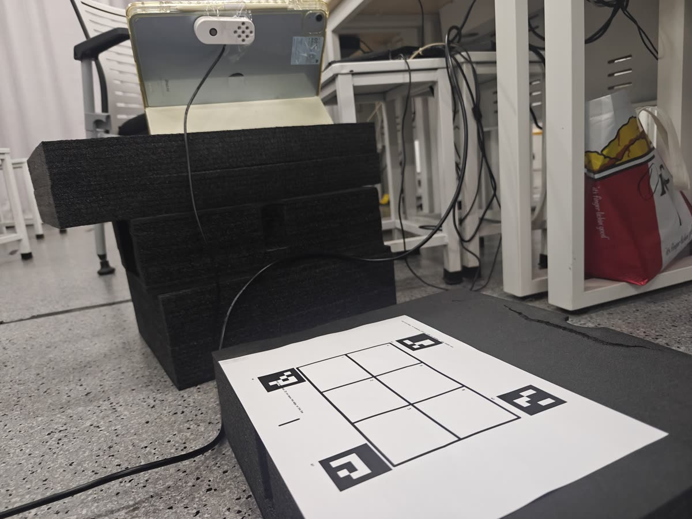
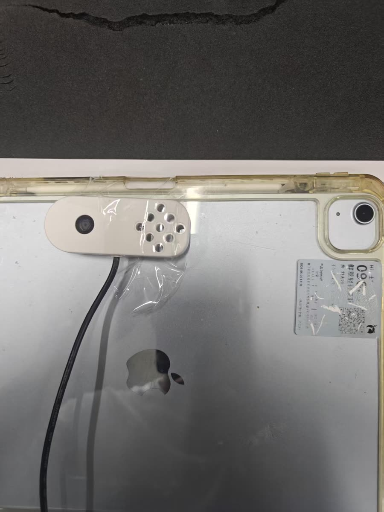
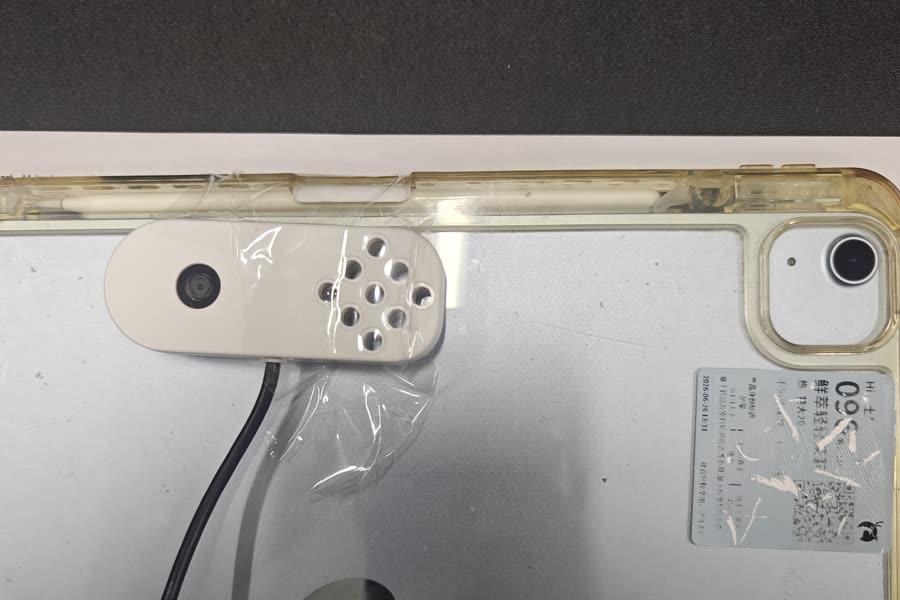
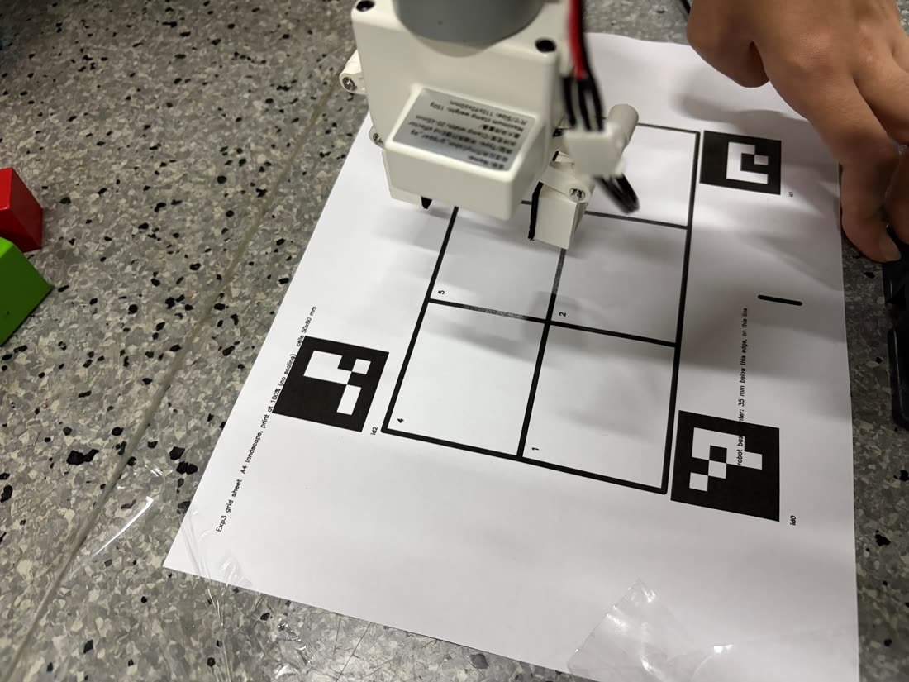
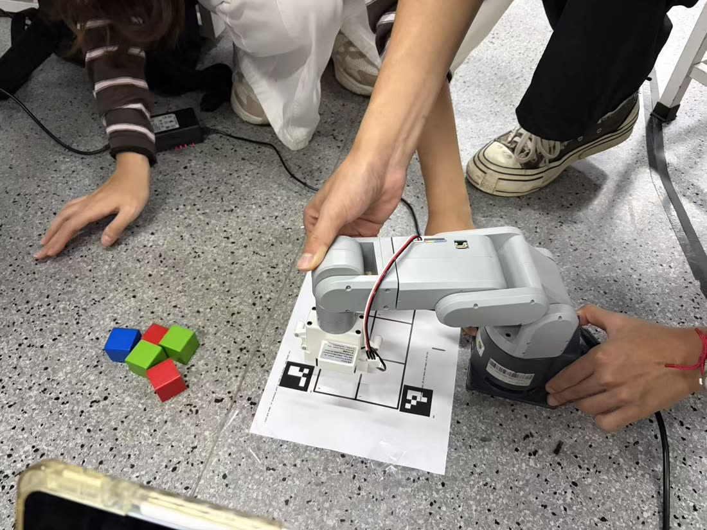
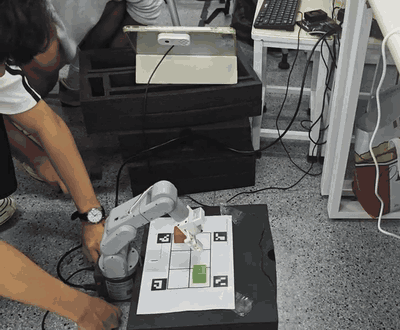
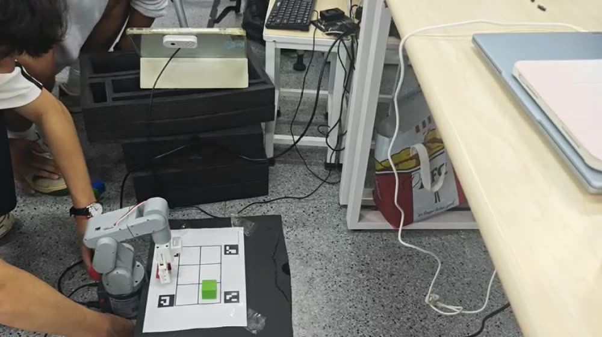

# 02-real-robot 真机阶段

真机阶段**复用实验二的机械臂驱动**，任务逻辑（识别 → 网格判断 → PickPlace 动作 → 状态机）与仿真是同一份代码，
启动文件在 `../01-simulation/mecharm_sort/launch/sort_real.launch.py`。

```
02-real-robot/
├── README.md
├── mecharm_real/        实验二的 Jetson 侧驱动包（原样复制，未改动）：real_driver 对外提供与仿真 ros2_control 一模一样的
│                        /arm_controller、/hand_controller 两个 FollowJointTrajectory 动作 + /joint_states，内部走网口到臂内 arm_server
│                        （含 teach.py：读当前六关节角，示教用）
└── arm_pi/              臂内树莓派上的 arm_server.py / arm_common.py（实验二原样），pymycobot 控制 mechArm 270
```

## 真机与仿真的差别（全部是参数和外设，逻辑不变）

| 项 | 仿真 | 真机 |
|---|---|---|
| 相机 | Gazebo 相机 | USB 相机（Realtek 0bda:3035，1280×720），节点 `usb_camera` |
| 识别 | 颜色分割 `color_detector` | YOLO `yolo_detector`，模型 `~/Desktop/yingjiehua/best.pt`（blue/green/red/yellow_cube）；可换 TensorRT 引擎 `best.engine`（`model:=` 参数） |
| 网格定位 | ArUco（与真机相同） | ArUco：网格纸四角 4 个码，相机随便摆，每次扫描自动算映射 |
| 抓取点 | 逆解 | 示教回放 `~/Desktop/exp3_taught_points.yaml`（6 个取物点 + 3 个空中放置点，上方点 = J2 抬 25°） |
| 机械臂 | gz_ros2_control | `mecharm_real/real_driver` → 臂内 `arm_server` |
| 夹取校验 | Gazebo 真值 | 驱动读夹爪值（夹空/夹偏时合爪动作直接失败 → 任务节点重试） |
| 落点核对 | Gazebo 真值 | 现场人工核对 |

## 现场

| 桌面布置：网格纸贴在机器人正前方 | 相机架在网格侧上方，位置角度随意 |
|---|---|
|  |  |

## 现场步骤

1. **打印网格纸**：`01-simulation/mecharm_sort/config/grid_sheet_A4.pdf`，A4 横向 100% 打印（不要缩放）。
   纸的近边中点对准机器人正前方，近边距底座中心 4 cm，用胶带固定。网格 3×2、格 5×6 cm、四角 4 个 ArUco 码。
2. **摆相机**：任意位置，只要画面里能看到网格和至少 3 个码，机械臂回零姿态不挡网格（建议放网格左侧上方斜看）。
   相机可以每次重摆，不需要标定。
3. **示教**：`ros2 run mecharm_sort teach_points all`（记录后自动低速回放验证） —— 6 个格的取物关节角（夹爪张开、指垫在方块中部高度）
   + 左/前/右各 1 个空中放置点（到点直接松爪扔下，人随手拿走）。文件在 `~/Desktop/exp3_taught_points.yaml`。
4. **编译**：把 `mecharm_real` 和 `mecharm_sort`、`mecharm_sort_interfaces` 一起放进工作区 `src/` 编译。
5. **臂内**：树莓派上启动 `arm_server.py`（实验二流程），Jetson 能 ping 通臂（默认 10.42.0.89）。
6. **先只测感知**：`ros2 launch mecharm_sort sort_real.launch.py arm:=none`，看 `/detections/image`
   里是否画出 4 个码、6 个格心十字和方块框。
7. **正式运行**：`ros2 launch mecharm_sort sort_real.launch.py host:=<臂 IP>`。日志在 `~/exp3_logs_real/real_<时间>/`。

完整可照抄的命令清单见 [`orderForReal.txt`](orderForReal.txt)。

| USB 相机固定方式（贴在 iPad 背面当支架，位置随意） |
|---|
|  |

相机不需要标定：程序每次扫描自己解单应矩阵，日志里会顺带估出相机位置（本次现场估计 `(0.12, 0.39, 高 0.37) m`，与实际摆放一致）。

## 示教：从人工摆位到六关节角

实现文件：`mecharm_real/mecharm_real/teach.py`，命令入口 `ros2 run mecharm_sort teach_points`。

| 变软后手扶机械臂摆到取物点 | 三色方块与网格纸（示教前布置） |
|---|---|
|  |  |

单个点的记录流程：

```python
# teach.py — teach_one()
def teach_one(cli, name, tip):
    cli.gripper(0)                    # 打开夹爪
    input('扶稳机械臂，准备开始示教')
    cli.soft()                        # 释放关节，进入可手动拖动状态
    input(f'摆到 {name} 点后按回车')
    resp = cli.record(name)           # 读取并保存六个关节角
    angles = resp['angles']
    print(f'{name}: {angles}')
    cli.hold()                        # 重新锁定关节，恢复机械臂控制
    return angles
```

| 命令 | 作用 |
|---|---|
| `cli.soft()` | 释放关节力矩，允许手动拖动 |
| `cli.record(name)` | 读取当前六个关节角并写入文件 |
| `cli.hold()` | 恢复关节控制，锁定当前姿态 |

### 记录 → 应用 → 验证的闭环

```
teach.py record  ──▶  taught_points.json（原始六关节角）
       │                      │
       │                      ▼
       │              teach.py apply  ──▶  real.yaml（抓取点 / 放置点参数）
       │                                          │
       │                                          ▼
       └────── 有偏差就重新 record ◀────── 低速回放确认（位置 / 姿态 / 路径 / 夹爪）
```

**回放确认标准**：到位准确 · 末端姿态正确 · 路径无碰撞 · 夹爪开合正常。

### 示教期间的电子限位判断

手摆时手腕很容易翻转过去，超限的示教点回放会被臂内固件直接拒绝（表现为"到位残差几十度"），
所以记录时就要拦住：

```python
# teach_points.py — 示教过程中的电子限位判断
JOINT_MIN_DEG   = [-170, -120, -170, -120, -170, -120]
JOINT_MAX_DEG   = [ 170,  120,  170,  120,  170,  120]
LIMIT_MARGIN_DEG = 5.0

def check_teach_limits(joints_deg):
    """返回是否允许继续示教。"""
    for i, angle in enumerate(joints_deg):
        lower, upper = JOINT_MIN_DEG[i], JOINT_MAX_DEG[i]
        if angle < lower or angle > upper:          # 超过电子限位
            print(f"[停止示教] J{i + 1} 超出限位：{angle:.1f}°，允许范围 {lower}°～{upper}°")
            return False
```

mechArm 270 实际卡得更紧的是 **J4 ±155°、J5 ±115°**，示教时优先让 J4 接近 0、J5 在 ±40° 内。

## 真机调试要点

辅助接口：`arm_pi/arm_common.py` · `arm_pi/arm_server.py`。

| 检查项 | 要求 |
|---|---|
| 高度与姿态 | 夹爪不能碰到桌面或网格纸 |
| 运动路径 | 移动过程不能遮挡相机视野，也不能撞到网格纸 |
| 速度参数 | 先低速验证，稳定后再调 `move_duration` / `max_speed` |
| 节点通信 | 确认命令被接收、执行结果有回传 |

闭环逻辑：**发布目标 → 执行动作 → 返回状态 → 切换流程**。任务节点读 `real.yaml` 里的示教参数发布动作目标，
机械臂控制节点执行关节运动和夹爪动作，状态反馈回传关节状态、运动结果与夹爪状态，任务节点据此判断是否进入下一步。

## 真机运行结果

完整跑通「扫描 → 落格 → 选目标 → 抓取 → 分类放置 → 回零 → 再扫描」闭环，
抓取定位、关节运动、夹爪动作、分类放置逐项验证通过。



### 特殊实验：二次投放后的 1→6 扫描与优先抓取

在完成 1–5 号格的抓取后，**在 1 号格重新放入一个红色方块**，检验循环扫描逻辑：

1. 完成原有 1–5 号目标的抓取；
2. 在 1 号格重新放入红色方块；
3. 再次按 1→6 顺序扫描全部格位；
4. 记录各格位的类别、置信度与占用状态；
5. 按格位编号选择第一个可抓取目标；
6. **优先抓取 1 号格中的红色方块**。



结论：中途补投的物体能被下一轮扫描正确纳入，不需要重启任务或人工干预 ——
这正是 `task_manager` 里"格子变空即清除跳过标记、每轮重新投票"设计的直接验证。

## 现场踩过的坑

真机阶段 12 条（编号 13–24）详见 [`../问题记录.md`](../问题记录.md)，对应代码改动见 [`../错误代码对照.md`](../错误代码对照.md)。最常撞到的四条：

| 现象 | 原因 | 处理 |
|---|---|---|
| 格 3 明明有方块却报"空" | 单应矩阵只对桌面平面成立，相机离桌 27 cm 斜视时 2.5 cm 高的方块顶面投影到桌面外 3–4 cm | 由单应矩阵反推相机位置做视差修正；落格容差 2.5 → 3 cm |
| 示教点回放"轨迹拒绝执行" | 手摆时手腕翻转，超出 J4 ±155° / J5 ±115° 电子限位 | 记录时查限位、记录后自动低速回放验证，超限当场重教 |
| 相机画面很卡 | 相机 30 fps 出帧、节点 15 Hz 读导致 V4L2 队列积压；1280×720 原图发给多个订阅者 | 单线程只留最新帧；调试图缩半、隔帧发；YOLO 开 FP16 |
| 连跑几轮后方块半路掉落 | 夹爪发热抓力下降；抬升 8–10 cm 过高、搬运路程长 | 抬升改 4 cm、横移 5–6 cm（launch 参数）；轮次间让夹爪降温 |
