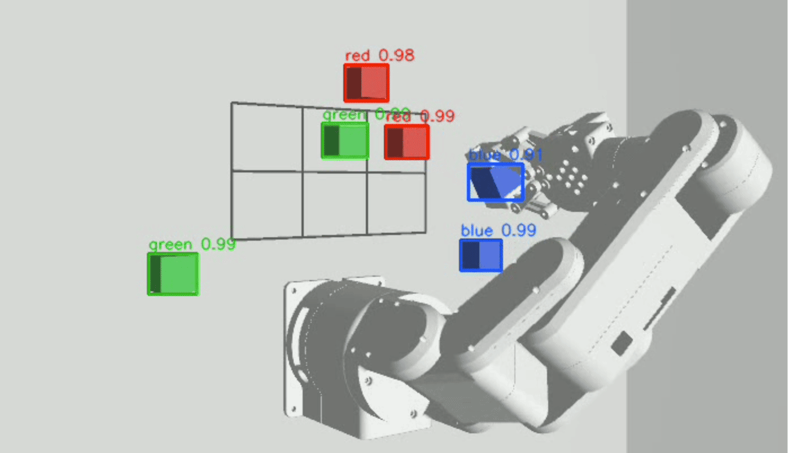
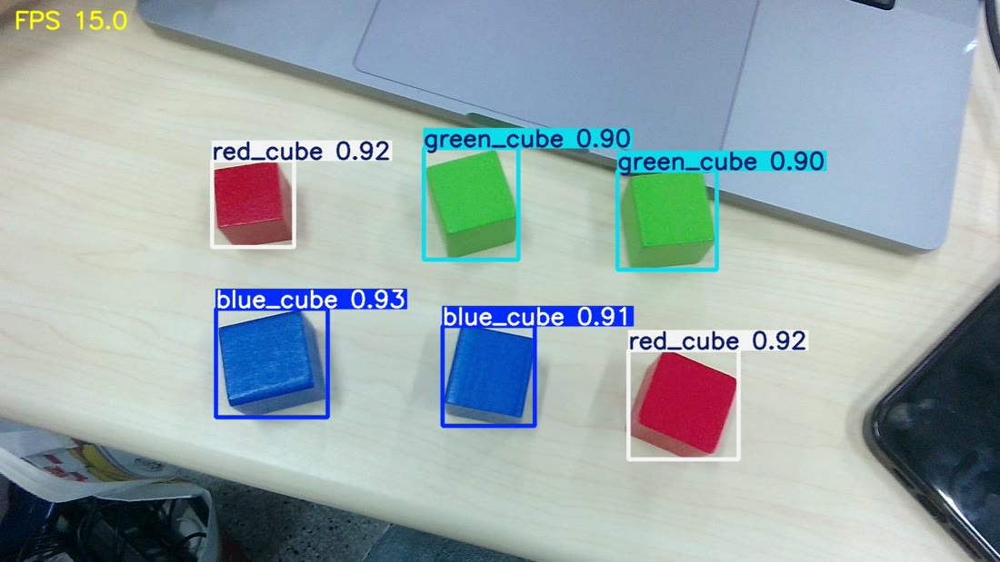
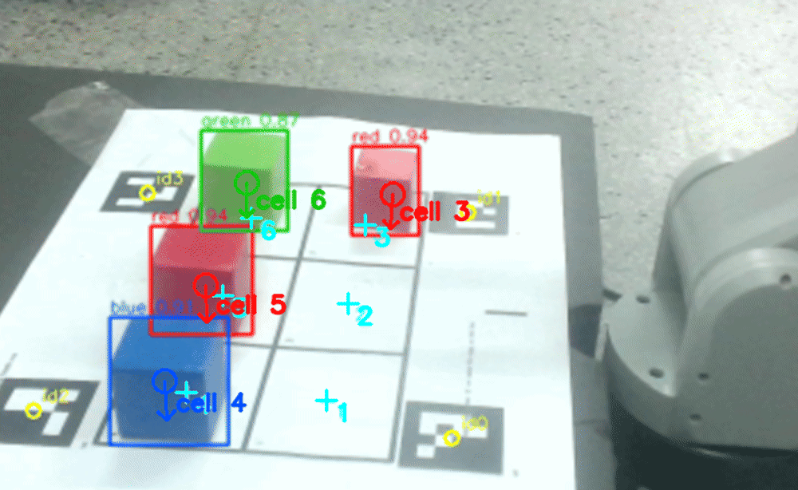
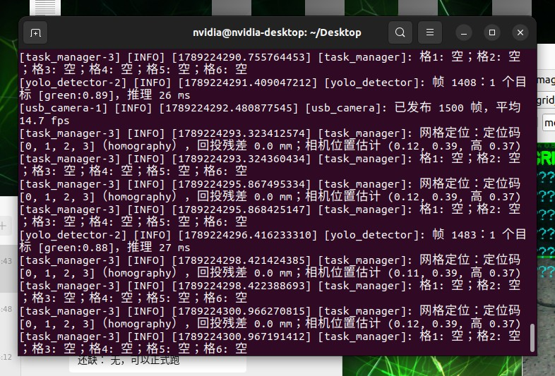
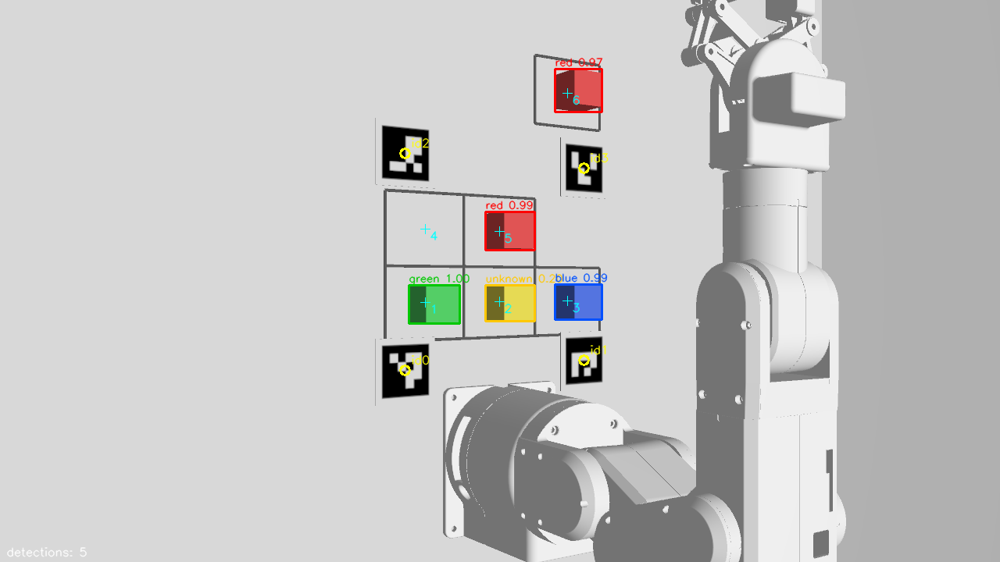

# 桌面物体自动分类整理

> 中国海洋大学 · 机器人集成小组项目 Ⅰ · 实验三 · 第 11 组
>
> **建立仿真 → 仿真迁移 → 真机识别 → 真机抓取**：先在 Gazebo 里打通「识别 — 判断 — 抓取 — 分类 — 异常处理」完整任务链，再用 USB 相机 + Jetson + mechArm 270 在真实桌面上验证。仿真与真机共用同一份任务代码，切换环境只换外设节点和参数文件。

| 仿真：Gazebo 相机 + 颜色分割 | 真机：USB 相机 + YOLOv8 |
|---|---|
|  |  |

---

## 一、实验目标

机器人自动识别 3×2 网格内的**红 / 绿 / 蓝三色方块**（边长 25 mm），按类别放到网格外对应的空桌面区域。
**任务开始后无需人工指定任何类别、网格或放置区**，全程自主循环直到网格清空。

| 类别 | 放置区域 |
|---|---|
| 绿色 | 网格**左侧**空桌面（机器人左手边，+y） |
| 红色 | 网格**前方**空桌面（移出网格区，+x） |
| 蓝色 | 网格**右侧**空桌面（机器人右手边，−y） |

桌面上**没有任何盒子**：只有一张打印的 3×2 网格纸，三个分类区就是网格外的空桌面。

## 二、四阶段路线与分工

| 阶段 | 内容 | 负责人 | 主要产出 |
|---|---|---|---|
| ① 建立仿真 | Gazebo 环境、ROS 2 识别与抓取节点、PickPlace 动作、任务状态机 | 陈德中 | [`01-simulation/`](01-simulation/) |
| ② 仿真迁移 | 外设节点替换、网格 1→6 依次扫描、定位纸与相机定位 | 纪汉林 | `grid_locator.py`、`grid_sheet_A4.pdf` |
| ③ 真机识别 | YOLOv8 三色方块训练、Jetson GPU 部署、`/detections` 接口对齐 | 华英杰 | [`docs/yolo-training.md`](docs/yolo-training.md) |
| ④ 真机抓取 | 示教与回放、`real.yaml` 参数协调、真机联调与特殊实验 | 初琦 | [`02-real-robot/`](02-real-robot/) |

## 三、系统架构

上游只负责"看见"，下游只负责"动作"，中间由任务节点把检测框、网格、类别与抓取指令组织成可恢复的闭环。

```
        ┌────────── 仿真链路 ──────────┐              ┌────────── 真机链路 ──────────┐
        Gazebo 相机                                    USB 相机 usb_camera
             │  sensor_msgs/Image  /camera/image_raw        │
             ▼                                              ▼
        color_detector（HSV 颜色分割）              yolo_detector（best.pt · CUDA FP16）
             │       vision_msgs/Detection2DArray   /detections
             └──────────────────┬───────────────────────────┘
                                ▼
                     task_manager（grid_locator 落格 · 多帧投票 · 表驱动状态机）
                                │  mecharm_sort_interfaces/action/PickPlace   /pick_place
                                ▼
                     pick_place_server（固定点规划 · 14 步取放 · 夹取校验 · 反馈）
                                │  control_msgs/FollowJointTrajectory  arm / hand
                 ┌──────────────┴──────────────┐
                 ▼                             ▼
         gz_ros2_control（仿真）        real_driver → 臂内 arm_server（真机）
```

**接口在仿真与真机之间完全一致**，因此状态机、动作协议和任务逻辑一行没改；
切换环境 = 换 launch 里的节点 + 参数文件（`sort.yaml` → `real.yaml`）。

| 环节 | 仿真（Gazebo） | 真机（Jetson + mechArm 270） |
|---|---|---|
| 相机 | Gazebo 相机插件 | USB 相机节点：OpenCV 读帧 → `sensor_msgs/Image` |
| 识别 | HSV 颜色分割 `color_detector` | YOLOv8 `yolo_detector`（`best.pt`） |
| 识别接口 | `vision_msgs/Detection2DArray` | **完全相同**：类别、检测框、置信度 |
| 网格定位 | ArUco 四角码 → 单应矩阵 | **同一套代码**，相机可任意摆放 |
| 抓取点 | 逆运动学（`grid.yaml` 坐标） | 示教回放（`taught_points.yaml`） |
| 机械臂 / 夹取校验 | `gz_ros2_control` / Gazebo 真值 | `real_driver` + 臂内 `arm_server` / 驱动读夹爪值 |

## 四、关键设计

### 1. 不用标定的网格定位（`grid_locator.py`）

网格纸四角印 4 个 ArUco 码（`DICT_4X4_50`，边长 3.5 cm），码中心在纸上的坐标是设计值、写在 `grid.yaml`。
每次扫描用 4 对「像素坐标 ↔ 桌面坐标」解一个 3×3 单应矩阵 `H`，相机位置、朝向、焦距全被 `H` 吸收：

```python
H, _ = cv2.findHomography(marker_px, marker_xy)   # 4 对点 → 单应矩阵
w = H @ [u, v, 1];  w /= w[2];  cell = nearest(cells, w, tol=0.03)
```

**相机不需要标定、不需要固定**，随手摆在任意位置，只要画面覆盖整张纸且至少 3 个码可见即可；`H⁻¹` 把格心投回画面就是截图里的青色十字，用于肉眼核对。

**视差修正**：`H` 只对桌面平面成立，方块顶面高 2.5 cm，低角度斜视时会投影到桌面外 3–4 cm（偏移 ≈ h / tan 仰角）——
真机仰角 35° 越界，仿真仰角 57° 恰好在容差内，所以这个坑只在真机暴露。
处理办法是由 `H` 反推相机位置，把检测点沿朝相机方向按 h/z 比例拉回，落格容差同时 2.5 → 3 cm。

| 真机扫描画面（黄圈 = 定位码，青十字 = 反算格心） | 运行日志：4 码全中，程序自估相机位姿 |
|---|---|
|  |  |

### 2. 多帧投票与 1→6 循环扫描（`task_manager.py`）

1. **只在回零姿态下识别**：机械臂到位后再等 2 s，连收 5 帧检测结果，运动中的画面一律不用。
2. **逐格投票**：每帧检测框中心（不是左上角）映射到网格，每格取多数类别，5 帧里过半才算稳定，否则标 `unstable` / 未识别。
3. **按编号 1→6 取第一个有物体的格**：中途在前面的格里放入新方块，下一轮就先处理；格子变空即清除跳过标记；
   全部处理完后再对夹取失败的格补抓一轮。

关键参数：`scan_frames=5` · `min_score=0.5` · `min_vote_ratio=0.5` · 落格容差 3 cm。

### 3. PickPlace 动作契约与失败分流

`Goal` 只描述任务语义（`command` / `grid_id` / `object_class` / `zone_id` / `slot`），不把关节角暴露给任务层；
`Feedback` 持续回报 `stage / step / total_steps`；`Result` 用 `failed_stage` 区分失败类型，状态机据此分流：

| `failed_stage` | 含义 | 处理 |
|---|---|---|
| `plan` | 不可达 / 关节超限 | 跳过该格，继续扫描 |
| `grasp_verify` | 夹空 | 松爪回零，重试 1 次，再失败进补抓轮次 |
| `controller` | 轨迹被拒绝 / 执行超时 | 手里有物体先到放置点上方释放，再回零 |
| `comm` | 动作服务器无响应 | 安全停止（ABORT） |

主链路由 `state_machine.yaml` 定义：`INIT → PARK → SCAN → SELECT → PICK_PLACE → SCAN …`，
无可执行目标则 `FINISH`，失败进 `HANDLE_FAIL`。发送超时 15 s，默认执行超时 240 s。

## 五、仓库结构

```
.
├── README.md                    本文件：总说明 / 验收对照
├── 问题记录.md                   24 条现象 → 原因 → 处理（仿真 1–12，真机 13–24）
├── 错误代码对照.md               与问题记录对应的修改前 / 修改后代码
├── 00-overview/                 实验要求文档
├── docs/
│   ├── yolo-training.md         阶段三：YOLOv8 三色方块训练与 Jetson 部署
│   └── images/                  README 用图（仿真、真机、训练结果）
├── 01-simulation/               仿真阶段（ROS 2 工程，真机复用同一份任务代码）
│   ├── README.md                仿真阶段完整使用说明
│   ├── 仿真实验报告.md
│   ├── mecharm_sort/            主功能包
│   │   ├── mecharm_sort/        color_detector · yolo_detector · usb_camera · grid_locator
│   │   │                        task_manager · pick_place_server · planner · kinematics
│   │   │                        gz_truth · teach_points
│   │   ├── config/              grid.yaml · state_machine.yaml · sort.yaml · real.yaml
│   │   │                        taught_points.yaml · grid_sheet_A4.pdf · check_layout.py
│   │   ├── launch/              sort_sim.launch.py · sort_real.launch.py
│   │   ├── model/               arm_model.xacro · sort_world.sdf · gen_world.py
│   │   └── markers/             aruco_0..3.png
│   ├── mecharm_sort_interfaces/ PickPlace.action
│   ├── scripts/                 run_sim.sh · stop_sim.sh · probe_poses.py
│   └── results/                 三次完整验收运行的日志、截图、相机视频
└── 02-real-robot/               真机阶段
    ├── README.md                现场步骤（贴纸 → 摆相机 → 示教 → 运行）
    ├── mecharm_real/            Jetson 侧驱动包 real_driver（+ teach.py 示教工具）
    ├── arm_pi/                  臂内树莓派 arm_server.py / arm_common.py
    ├── orderForReal.txt         真机指令清单（照着敲即可跑通）
    └── taught_points_real_*.yaml 示教点备份
```

## 六、快速开始

两个阶段都在 Jetson 上运行（Mac 通过 USB-C 连 Jetson，`ssh nvidia@192.168.55.1`）。
每开一个新终端先加载环境：

```bash
source /opt/ros/humble/setup.bash && source ~/mecharm_ws/install/setup.bash && source ~/Desktop/exp3_sim_ws/install/setup.bash
```

**仿真**（详见 [`01-simulation/README.md`](01-simulation/README.md)）：

```bash
ros2 launch mecharm_sort sort_sim.launch.py gui:=false                    # 正常场景
ros2 launch mecharm_sort sort_sim.launch.py gui:=false scenario:=abnormal # 异常场景
```

**真机**（详见 [`02-real-robot/README.md`](02-real-robot/README.md) 与 [`orderForReal.txt`](02-real-robot/orderForReal.txt)）：

```bash
ros2 launch mecharm_sort sort_real.launch.py arm:=none    # 先只测感知，不接机械臂
ros2 launch mecharm_sort sort_real.launch.py host:=10.42.0.89
```

## 七、验收结果

### 仿真（`01-simulation/results/`）

| 场景 | 结果 | 说明 |
|---|---|---|
| `normal/` 正常 | **6 / 6 正确分类**（要求 ≥ 5/6） | 7 次扫描、6 轮抓取，绿红蓝各 2 个；每轮约 32 s，无碰撞、无超限 |
| `normal_taught_camera_right/` | **6 / 6** | 改用示教回放模式 + 相机从左侧挪到右侧，**不改任何参数**仍全部成功 |
| `abnormal/` 异常 | **4 类异常全部正确处理**（要求 ≥ 2 类） | 空网格 / 未识别（黄块）/ 不可达 / 夹取失败；3 个可分类目标全部完成 |

证据链：`detections.csv` → `grasp_results.csv` → `task_state.log` → `errors.log` → `summary.txt`，
外加每次扫描截图 `scan_NN.png` 与全程相机视频 `camera_view.mp4`。



### 真机识别（YOLOv8n，详见 [`docs/yolo-training.md`](docs/yolo-training.md)）

| 指标 | 数值 |
|---|---|
| 三色宏平均 mAP50 | **0.980** |
| 三色宏平均 mAP50–95 | **0.849** |
| 独立测试集 | 44 张图 / 141 个目标框 |
| 最佳权重 | 第 66 轮 `best.pt`（第 86 轮早停） |
| Jetson 实时性能 | 1280×720 @ 15 fps，单帧推理 22.4 ms（CUDA FP16） |

### 真机抓取

- 示教 9 个点（6 个取物点 + 左 / 前 / 右各 1 个空中放置点），记录后自动低速回放验证，超限当场重教。
- 完整跑通「扫描 → 落格 → 选目标 → 抓取 → 分类放置 → 回零 → 再扫描」闭环，抓取定位、关节运动、夹爪动作、分类放置逐项验证。
- **特殊实验**：完成 1–5 号格抓取后，在 1 号格重新放入红色方块；系统再次按 1→6 扫描，
  正确记录各格类别与占用状态，并**优先抓取 1 号格的红色方块** —— 验证了中途补投也能被纳入循环。

## 八、踩过的坑（完整 24 条见 [`问题记录.md`](问题记录.md)）

| 阶段 | 现象 | 原因 | 解决 |
|---|---|---|---|
| ① 仿真 | 方块在松爪之前提前掉落 | 放置姿态允许倾斜 40°，方块靠摩擦夹持，倾斜后从指间滑出 | 夹着方块的所有路径点工具保持竖直（≤15°）；释放高度 3 cm → 8 mm |
| ② 迁移 | 格 3 明明有方块却报"空" | 单应矩阵只对桌面平面成立，低角度斜视时 2.5 cm 高的方块顶面投影到桌面外 3–4 cm | 由 `H` 反推相机位置做视差修正；落格容差 2.5 → 3 cm |
| ③ 识别 | 预训练模型置信度只有 0.4–0.7，常把蓝色地板认成蓝方块 | 训练数据与现场物体、光照、背景不匹配，模型只学到颜色特征 | 自拍现场数据集（含地板等背景负样本）迁移训练，置信度升到 0.9 以上，误检消失 |
| ④ 抓取 | 示教点回放报"轨迹拒绝执行"，到位残差几十度 | 变软手摆时手腕翻转，J4 ±155° / J5 ±115° 电子限位被固件拒绝 | 示教时检查限位、记录后自动低速回放验证，超限当场重教 |
| ④ 抓取 | 连跑几轮后方块半路掉落 | 夹爪发热抓力下降，抬升 8–10 cm 过高、搬运路程长 | 抬升改 4 cm、横移 5–6 cm 并做成 launch 参数；轮次间让夹爪降温 |

**共性经验**：仿真暴露不出的问题集中在「真实传感器、真实机械限位、真实物理（发热 / 摩擦）」三处，
都靠现场日志（`detections.csv` / `errors.log` / 到位残差）定位，改的是参数和校验逻辑，**任务流程未动**。

## 九、文档索引

| 文档 | 内容 |
|---|---|
| [`01-simulation/README.md`](01-simulation/README.md) | 仿真阶段：文件结构、编译运行、工作原理、异常处理、验收数据、改布局流程 |
| [`01-simulation/仿真实验报告.md`](01-simulation/仿真实验报告.md) | 仿真阶段实验报告 |
| [`01-simulation/results/README.md`](01-simulation/results/README.md) | 三次验收运行的逐轮数据与复现命令 |
| [`02-real-robot/README.md`](02-real-robot/README.md) | 真机阶段：与仿真的差别、现场步骤 |
| [`02-real-robot/orderForReal.txt`](02-real-robot/orderForReal.txt) | 真机指令清单（接线 → 贴纸 → 示教 → 运行） |
| [`docs/yolo-training.md`](docs/yolo-training.md) | YOLOv8 训练设置、指标、Jetson 部署与检测接口 |
| [`问题记录.md`](问题记录.md) | 24 条问题：现象 → 原因 → 处理 |
| [`错误代码对照.md`](错误代码对照.md) | 对应的修改前 / 修改后代码片段 |

## 十、小组成员

陈德中 · 纪汉林 · 华英杰 · 初琦
