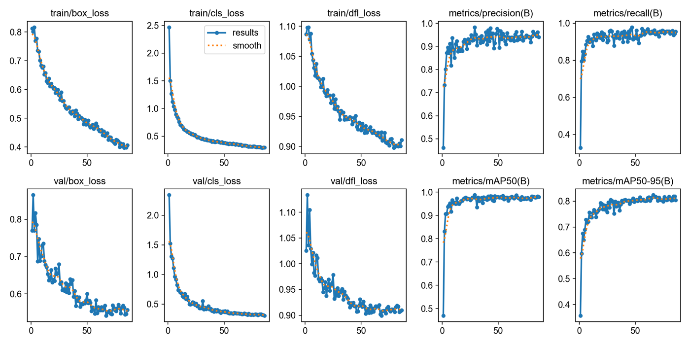
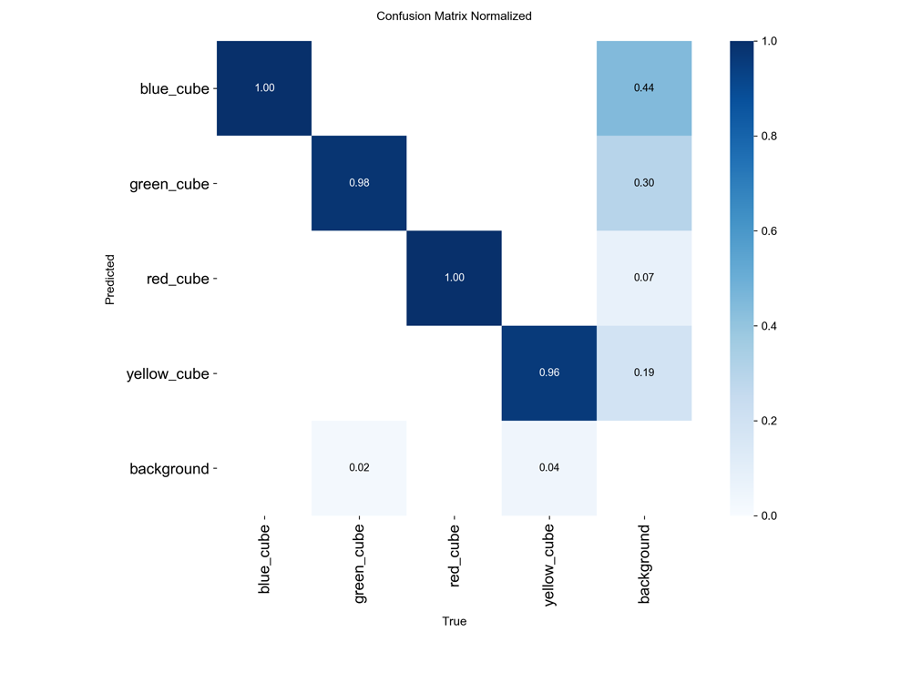
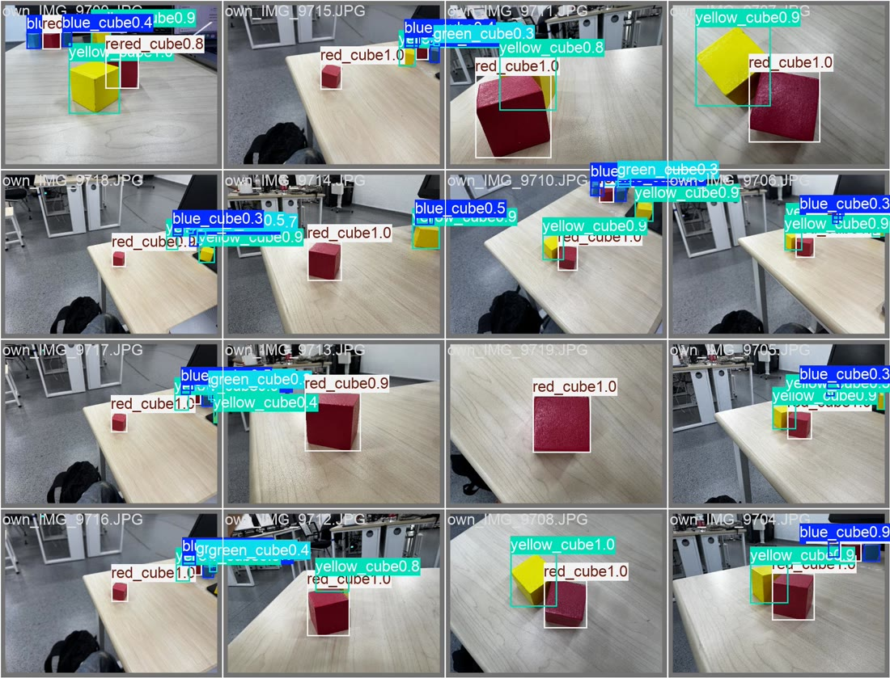

# 阶段三 · YOLOv8 真机识别：训练、迁移与目标挑选

> 负责人：华英杰
>
> 本文覆盖的范围：从现场数据集到 Jetson 上实时发布 `/detections` **为止**。
> 示教、机械臂驱动、抓取参数与任务状态机见 [`../02-real-robot/README.md`](../02-real-robot/README.md) 和 [`../01-simulation/README.md`](../01-simulation/README.md)。

## 一、为什么要自己训练

网上找的预训练模型在现场的置信度只有 0.4–0.7，而且**经常把蓝色地板识别成蓝色方块**：
训练数据与现场的物体、光照、背景都不匹配，模型基本只学到了颜色特征，地板这类背景从没在训练集里出现过。

解决办法是自己拍现场数据集做迁移训练，并特意把地板、桌面、线缆这类背景当负样本拍进去。
训练后置信度稳定在 0.9 以上，误检消失。

## 二、训练设置

| 项 | 取值 |
|---|---|
| 基础模型 | `yolov8n.pt` |
| 输入尺寸 | `imgsz=640` |
| 批大小 | `batch=8` |
| 早停 | `patience=20` |
| 随机种子 | `seed=42` |
| 实际训练轮数 | 86 轮（第 86 轮触发早停） |
| 选用权重 | **第 66 轮 `best.pt`** |
| 训练类别 | `red_cube` / `green_cube` / `blue_cube`（另含 `yellow_cube`，用于验证"未识别物体"分支） |

部署使用 `best.pt` 而不是 `last.pt`，避免继续训练带来的过拟合。



损失下降后趋稳，`metrics/mAP50(B)` 与 `metrics/mAP50-95(B)` 在后半段保持在高位。

## 三、独立测试结果

| 指标 | 数值 |
|---|---|
| 独立测试图片 | 44 张 |
| 测试目标框 | 141 个 |
| 三色宏平均 mAP50 | **0.980** |
| 三色宏平均 mAP50–95 | **0.849** |
| best epoch | 66 |

| 归一化混淆矩阵 | 验证集批次预测 |
|---|---|
|  |  |

三色对角线均在 0.96 以上；`background` 列的漏检主要出现在远处、强反光和严重遮挡的框上，
现场通过"只在回零姿态下取 5 帧投票"规避（见 `task_manager.py` 的 `s_scan`）。

## 四、迁移到 Jetson

### 环境

| 项 | 版本 |
|---|---|
| 系统 | Ubuntu 22.04.5 |
| L4T | R36.4.7 |
| CUDA | 12.6 |
| PyTorch | 2.5（NVIDIA 版） |
| Ultralytics | 8.4.52 |

### 部署四步

1. **复制权重**：把 `best.pt` 放到 `~/Desktop/yingjiehua`。
2. **连接相机**：USB 相机走 `/dev/video0`，画面 1280×720。
3. **启用 GPU 推理**：`device='0'`、`half=True`、`imgsz=640`。
4. **只保留最新帧**：后台线程不停读相机、只处理最新画面，避免帧积压。

```bash
cd ~/Desktop/yingjiehua
./运行摄像头检测.sh
# Loading best.pt
# Inference device: CUDA GPU
# Live preview: http://192.168.55.1:8000
```

### 检测参数

`conf=0.5` · `iou=0.5` · 调试图缩放 0.5 · 每 2 帧发布一次。

### 现场优化记录

相机画面卡顿的主要原因是**帧积压**和**大图传输**：相机 30 fps 出帧而节点 15 Hz 读，V4L2 队列积压；
1280×720 原图又同时发给多个订阅者。改为单线程不停读、只留最新帧，并把调试图缩半、隔帧发布后，检测画面可以持续更新。

TensorRT 引擎转换成功但整体提速不明显（模型只有 3 M 参数，本来就是 21–22 ms/帧），因此现场保留 CUDA FP16。

## 五、ROS 2 检测接口

```
USB 相机 ──/camera/image_raw──▶ yolo_detector ──/detections──▶ task_manager
   usb_camera                 best.pt + CUDA FP16      vision_msgs/Detection2DArray
```

类别整理与筛选规则：

1. 模型类别名为 `red_cube` / `green_cube` / `blue_cube`；
2. 发布时**自动去掉 `_cube` 后缀**，与仿真 `color_detector` 的类别名保持一致；
3. 置信度达到 0.5 才算有效检测，保留 `bbox` 与 `center`；
4. 同一帧内用 `red_0`、`blue_1` 这样的唯一 id 标识目标。

```python
res = model.predict(frame, conf=0.5, iou=0.5, imgsz=640)
cls = class_map.get(raw, raw)          # red_cube → red
det.id = f'{cls}_{i}'
det.hypothesis.class_id = cls
det.hypothesis.score = float(res.boxes.conf[i])
publisher.publish(out)
```

因为输出消息类型、话题名和类别名都与仿真完全相同，**任务节点、抓取服务器和状态机一行没改**。

## 六、真机识别结果


同一帧的真实检测结果：

| 指标 | 数值 |
|---|---|
| 画面 FPS | 15.0 |
| 该帧推理耗时 | 22.4 ms |
| 有效目标 | 6 |
| 识别类别 | 3（red / green / blue） |

```json
{"fps": 14.9754, "inference_ms": 22.4464}
blue 0.9319   red 0.9211   red 0.9151
blue 0.9054   green 0.9045  green 0.9011
```

截图与 JSON 使用**相同时间戳**同时保存，JSON 记录 `fps`、`inference_ms`、`class_name`、`confidence`、`bbox`、`center`，
可以逐项复核画面中的每个目标。

**结论**：真实画面连续稳定识别 6 个三色方块，并持续向任务节点输出可用的待选目标列表。
